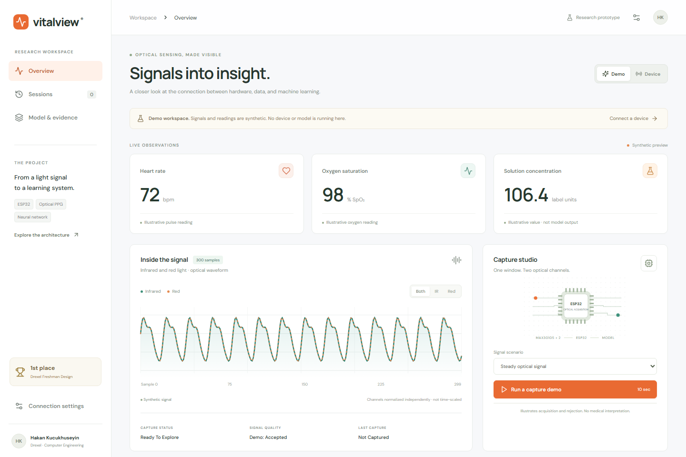
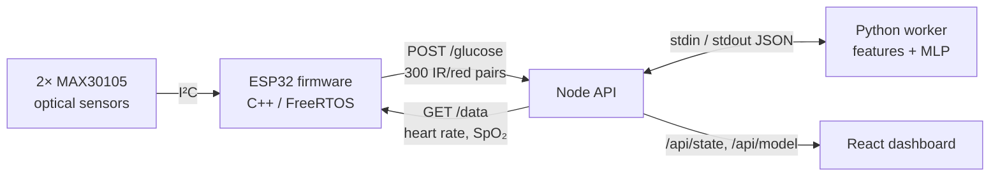
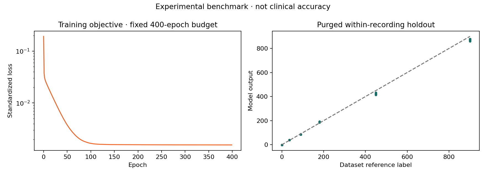

# VitalView

**An optical sensing system that goes from an ESP32 to a neural network to a live dashboard.**
First place, Drexel Freshman Design.

<!-- After the first GitHub Pages deploy, add: **[Live demo](https://<username>.github.io/<repo>/)** -->



Two MAX30105 optical sensors on an ESP32 shine infrared and red light through Petri-dish glucose
solutions (thickened with xanthan gum to approximate blood viscosity) and read heart rate from a
fingertip. The firmware streams 300-sample windows to a Node API. A Python neural network estimates
the solution concentration, and a React dashboard shows the waveform, signal quality, results, and
the evidence behind the model.

> **Research prototype.** The output is an experimental estimate for lab solutions, not a blood
> glucose measurement. Do not use it for diagnosis or treatment.

## Highlights

- **One system, four layers.** C++ firmware on FreeRTOS, a Node.js API, a Python ML pipeline, and a
  React frontend, connected by a small documented [API](docs/API.md).
- **Found and fixed data leakage.** 5,463 of the 5,468 adjacent training windows share 299 of their
  300 samples, so a random train/test split would put near-identical data on both sides. Training
  uses a purged split instead: 2,571 training windows, a 299-window gap, and 1,104 held-out windows.
- **Refuses rather than guesses.** Inference rejects weak, flat, or saturated signals, inputs outside
  the training feature range, and outputs outside the label range, and says why.
- **Reliable firmware.** Red and IR are read from the same FIFO entry, FIFO overflows invalidate the
  window instead of silently leaving a gap, and networking runs on separate FreeRTOS tasks so
  uploads never stall sensor sampling. See [firmware changes](firmware/README.md#changes-from-the-first-revision).
- **Secure local API.** Every sample is validated; bearer tokens use constant-time comparison;
  origin and Host checks block DNS rebinding; the model is portable JSON, so no pickle is executed.
- **Tested and checked in CI.** 26 JavaScript tests (API, React DOM, configuration, concurrency) and
  8 Python tests run on Windows and Linux, along with Prettier, Black, and a Gitleaks secret scan.

## Architecture



| Layer    | Stack                                             | Code                   |
| -------- | ------------------------------------------------- | ---------------------- |
| Firmware | ESP32, Arduino, FreeRTOS, MAX30105, SSD1306 OLED  | [firmware/](firmware/) |
| Backend  | Node.js (no framework), per-capture Python worker | [server/](server/)     |
| ML       | NumPy, pandas, scikit-learn MLP, matplotlib       | [ml/](ml/)             |
| Frontend | React 19, Vite, lucide icons                      | [web/](web/)           |
| Tooling  | node:test, unittest, jsdom, GitHub Actions        | [tests/](tests/)       |

## My role

I built everything in this repository: the ESP32 firmware, the Node API, the training and inference
pipeline, and the React dashboard.

## Results

The model is a 23 → 64 → 32 → 1 MLP on 23 summary features of the optical signal (seed 42, 400 epochs).
Errors are in dataset label units:

| Model                    | Holdout MAE | Holdout RMSE |
| ------------------------ | ----------: | -----------: |
| Neural network           |       13.17 |        17.40 |
| Linear ridge baseline    |      209.26 |       279.48 |
| Training-median baseline |      260.18 |       375.69 |



**What this does and doesn't show.** Each of the six concentrations (0–900) was a single continuous
recording, so the holdout uses later windows of recordings the model also trained on. That shows the
pipeline is consistent within a recording. It does not show the model works on new dishes, sessions,
or devices, and it could be learning recording-specific brightness rather than concentration. The
next step is to record independent preparations of each concentration and hold out whole sessions.

## Run it

**Demo only (no hardware or Python):** open `VitalView-Demo.html` in a browser.

**Full application.** Requires Node 22.22.2+ (22.x), 24.15+ (24.x), or 26+, and Python 3.11+:

```sh
python -m venv .venv
source .venv/bin/activate          # Windows PowerShell: .venv\Scripts\Activate.ps1
python -m pip install -r requirements.txt
npm ci
npm run build
npm start                          # http://127.0.0.1:8787
```

The dashboard opens in **Device** mode; switch to **Demo** for synthetic data. `npm run demo:device`
sends simulated captures through the real API. The training dataset and model weights are not
published, so a fresh clone runs the demo and tests, while live inference needs a model trained with
`python ml/train.py <dataset.csv> --output artifacts`.

To connect real hardware, see the [integration guide](docs/INTEGRATION.md) and
[firmware setup](firmware/README.md).

**Tests:** `npm test` builds the app and runs the JavaScript and Python suites.

## Repository layout

```
firmware/   ESP32 sketch, PlatformIO config, wiring and setup
server/     HTTP routing, validation, auth, device polling, Python worker
ml/         Feature extraction, training, portable inference
web/        React app: App.jsx, pages/, components/, lib/, hooks/
tests/      API, React DOM, publication-check, and Python tests
scripts/    Demo export, device simulator, publication check
docs/       API contract, integration guide, development guide
```

More detail: [development guide](docs/DEVELOPMENT.md) · [API](docs/API.md) ·
[integration](docs/INTEGRATION.md) · [firmware](firmware/README.md)

## Limitations

- Lab solutions only; the estimate is not a human glucose measurement.
- Concentration units, gum quantities, and preparation details are not yet documented.
- The SpO₂ formula is uncalibrated and labeled experimental.
- The firmware compiles for `esp32dev`, but this revision has not been re-tested on physical hardware.
